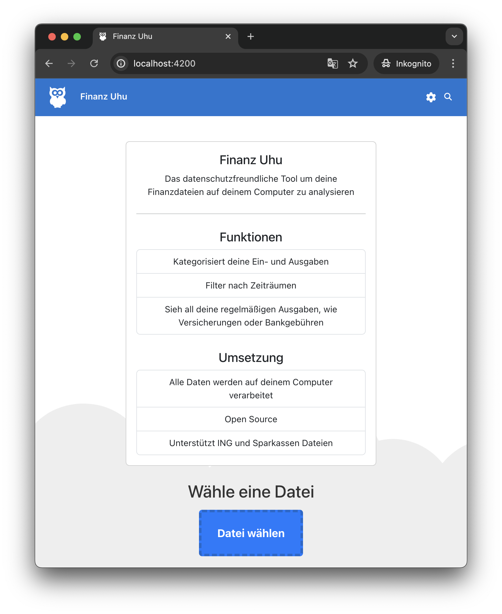

# FinanceAnalyser

The privacy-friendly tool to analyze your financial files on your computer.

Try out the [Demo](https://finanz-uhu.xremix.de/) with the [Demo CSV](https://raw.githubusercontent.com/xremix/FinanceAnalyser/main/demo.csv) and see the functionality of the App.

## Getting Started

To run you need to have npm, and the ng-cli installed.

- `npm install`
- `ng serve`

## Deploy

The following task is currently being used to deploy the app

- `ng build`
